# OOC Relation Plugin — AI 驱动的 C 语言面向对象开发助手


**OOC Relation Plugin** 是一个专为 **C 语言面向对象编程（OOC, Object-Oriented C）** 设计的 Visual Studio Code 扩展。它在提供完整的类关系管理、可视化与代码生成功能的同时，创新性地集成了 **AI 自然语言驱动开发** 与 **Codebase Memory MCP**，让 AI 能真正“读懂”你的 OOC 代码库，从而更精准、更安全地协助你完成开发任务。

## 为什么需要它？

在嵌入式、操作系统内核等大型 C 项目中，开发者经常使用结构体嵌套和函数指针表来模拟面向对象（继承、多态、虚表）。然而，传统 IDE 对这种手动面向对象模式的支持几乎为零。常见的扩展往往会在启动时**全量扫描所有头文件**，导致大型工程卡顿。

OOC Relation Plugin 采用 **“操作即记录”** 的轻量级缓存架构：**只追踪你真正操作过的类，永不扫描无关文件**。同时，借助 DeepSeek 大模型与 Codebase Memory MCP 的代码理解能力，你可以用自然语言直接生成或修改复杂的 OOC 代码，**彻底告别手工拼接代码和繁琐的插件命令**。

- ## 核心功能一览

  ### 1. 📊 可视化继承树

  - 侧边栏实时展示所有已记录类的树形关系。
  - 图标区分普通类、接口、拥有虚表的类，悬停可查看文件路径、虚表信息等。
  - 单击节点直接打开对应头文件。

  ### 2. 🛠️ 一键创建 OOC 类/接口/子类

  - 通过右键菜单或命令面板，快速生成基类、接口或子类的 `.h` / `.c` 文件。
  - 自动填充 OOC 模板：`union` 继承、虚表指针、`init` / `deinit` 函数等。
  - 所有创建操作自动记录到关系表，视图即时刷新，无需全量扫描。

  ### 3. 🧩 智能虚函数管理

  - **添加虚函数**：自动检测继承链，向上查找祖先虚表，必要时插入占位符并传播虚表变化。
  - **重写虚函数**：列出所有祖先虚方法，已重写的自动禁用，未重写的可一键生成 `override` 实现。
  - 可视化面板提供防重名校验，支持批量添加虚函数。

  ### 4. 🔧 常规方法与成员变量管理

  - **Fun 表方法**：通过面板快速添加普通函数指针，自动插入声明、实现与初始化赋值。
  - **成员变量**：可视化添加，自动插入到结构体定义中。

  ### 5. 📈 PlantUML 类图生成

  - 基于缓存中的类关系，一键生成标准 UML 类图。
  - 自动识别接口、虚函数（标记 `{abstract}`）、依赖、聚合等关系。
  - 支持缩放、拖拽，并**可保存为 .puml 文件**，便于集成到文档。

  ### 6. 🧠 AI 自然语言驱动开发（DeepSeek 集成）

  插件内置了 **AI 编程代理（Chat Participant）**，你可以用**中文**直接描述需求，AI 会自动规划并执行所有操作。

  ### 7. 🔗 Codebase Memory MCP 集成 — 赋予 AI 真正的代码理解能力

  为了让 AI 更好地理解你的 OOC 项目结构，我们集成了 **Codebase Memory MCP（Model Context Protocol）**。该功能会为你的代码库建立深层语义索引，使 AI 能够：

  - **理解现有类的继承关系、虚表结构和成员函数签名**，即使它们未被插件显式记录。
  - **智能推断上下文**：当你要求修改某个函数时，AI 可以自动找到相关的头文件、虚表定义和调用链。
  - **减少错误**：AI 在生成代码前可先“查阅”现有代码，避免重复定义或签名不匹配。
  - **提升多步操作成功率**：结合插件自有的关系缓存，AI 能更准确地规划虚表传播、占位符更新等复杂操作。

  启用此功能后，你的 AI 代理将不再局限于插件操作过的类，而是能**像一位熟悉你整个代码库的资深开发者一样**，提供更精准的建议和代码生成。


## 使用方式

### 命令
| 命令 | 说明 |
|------|------|
| `OOC: Create Class` | 创建基类（右键文件夹） |
| `OOC: Create Interface` | 创建接口（右键文件夹） |
| `OOC: Create Subclass` | 创建子类（右键 .h 文件） |
| `OOC: Add Virtual Method` | 添加虚函数（右键 .h 文件） |
| `OOC: Add Regular Method` | 添加常规方法（右键 .h 文件） |
| `OOC: Override Methods` | 重写祖先虚函数（右键 .h 文件） |
| `OOC: Add Members` | 添加成员变量（右键 .h 文件） |
| `OOC: Show Class Diagram` | 生成 PlantUML 类图（可通过树视图节点调用） |

### 创建一个对象
空白处右键点击，选择OOC：Create Class  

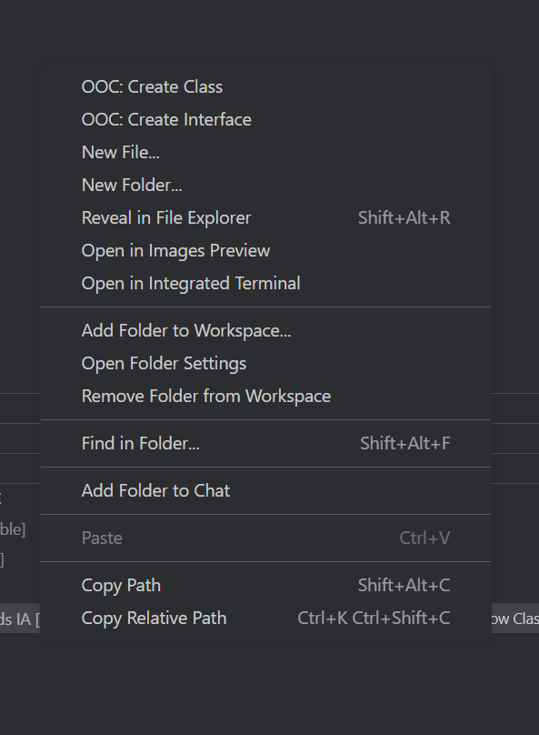

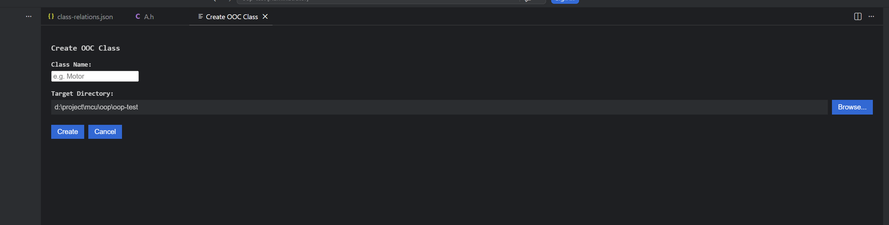

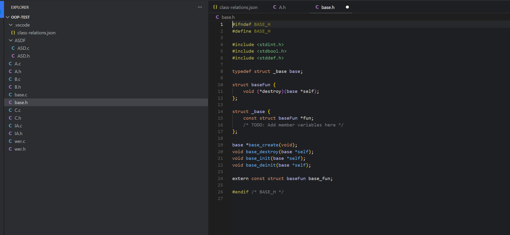


### 创建一个子对象

选择某个对象的h文件，右键点击，选择OOC：Create Subclass  

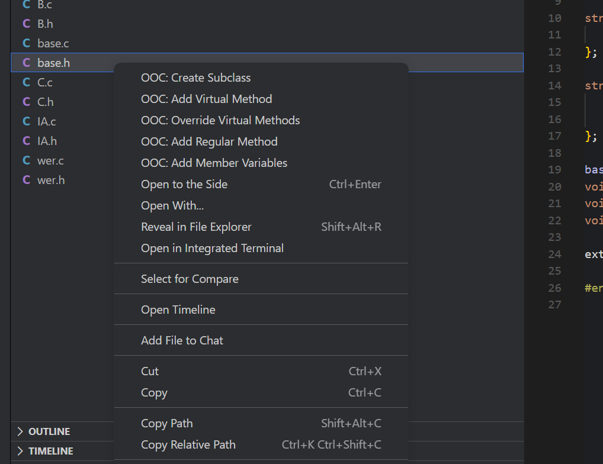

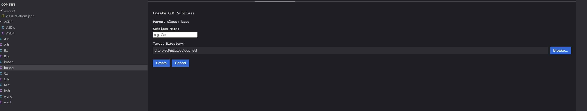

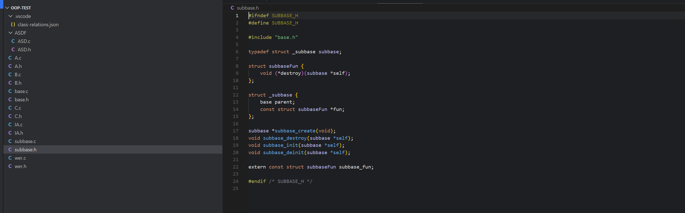


### 添加一个虚函数

选择某个对象的h文件，右键点击，选择OOC：Add Virtural Method

 对话框中会列出父类的所有虚函数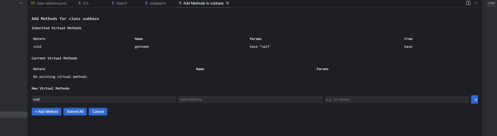


### 重写虚函数

选择某个对象的h文件，右键点击，选择OOC：Override Virtural Method

 对话框中会列出父类的所有可以重写的虚函数

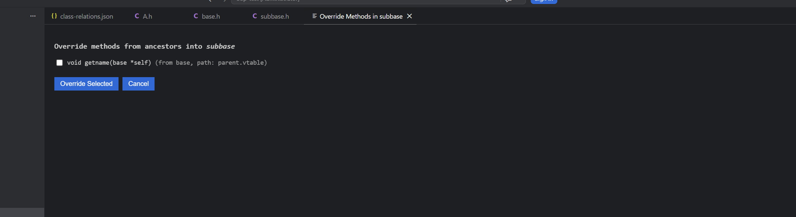


### 侧边栏类关系树状图

打开 “OOC Inheritance” 视图，展开即可看到树形继承结构。

点击节点打开对应头文件。  

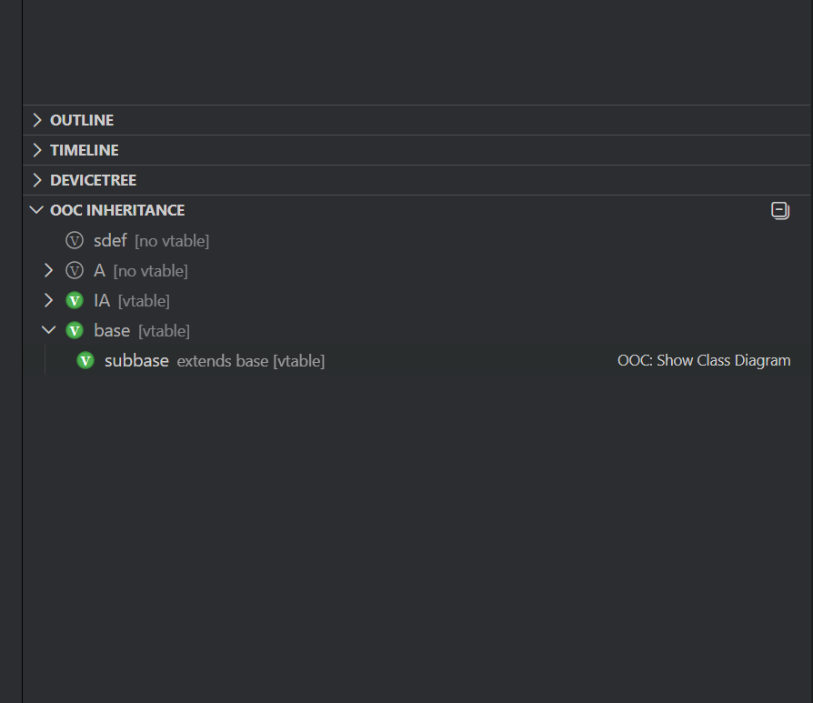


### 类关系生成PUNML类图

打开 “OOC Inheritance” 视图，展开即可看到树形继承结构。  

- 点击OOC：Show Class Diagram

  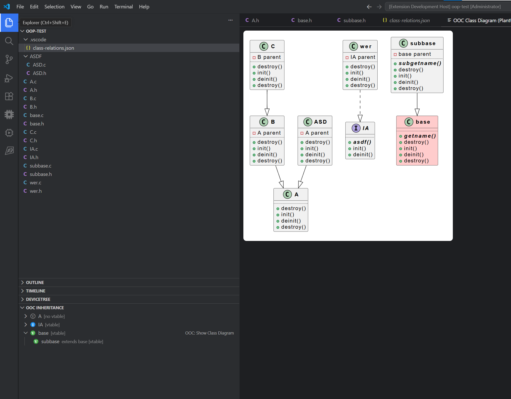

### PlantUML 类图
类图提供拖拽和 Ctrl+滚轮缩放，并包含保存按钮，可将当前 PlantUML 源码导出为 `.puml` 文件。


### AI编程使用

在 VS Code Chat 面板OOC AI CHAT：AI助手 对话框中输入：

text

```
创建一个基类 Animal，包含虚函数 speak 和 eat。然后创建一个接口 IAnimal，包含虚函数 move。再创建 Animal 的子类 Dog，重写 speak 方法，添加一个常规方法 run（无额外参数），并为 Dog 添加成员变量 age（int 类型）和 name（const char* 类型）。
```


AI 将按顺序自动完成：创建类、添加虚函数、创建接口、创建子类、重写方法、添加常规方法、添加成员变量，**全程无需手动操作**。

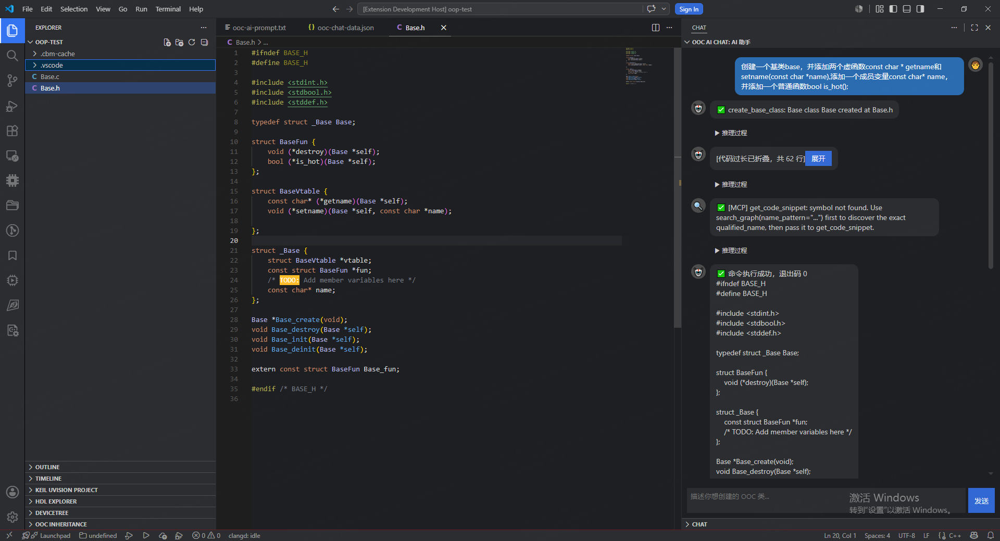

#### 更多 AI 能力：

- 实现业务逻辑：`实现 UartSerial 的所有重写虚函数，并在 init 中设置波特率 115200`
- 精准修改函数体：`用以下内容替换 override_UartSerial_Serial_open_impl 的函数体：...`
- 添加私有函数、全局变量、头文件包含等

AI 会**严格遵循 OOC 编码规范**，不破坏已有的模板代码（如 `_init` / `_deinit` 函数），并支持多轮对话，自动修复参数错误，确保生成代码的正确性。

## 安装

1. 在 VS Code 中按 `Ctrl+Shift+X` 打开扩展市场，搜索 “OOC Relation Plugin” 并安装。  
2. 或从 VSIX 手动安装：下载 `ooc-relation-plugin-x.x.x.vsix`，运行 `code --install-extension ooc-relation-plugin-x.x.x.vsix`。  
3. 也可克隆仓库到 `.vscode/extensions` 目录。

## 依赖

- 需要 `plantuml-encoder` 用于生成类图图片（自动包含于安装包）。
- 其他依赖已在 `package.json` 中声明。

## 配置

插件自动在工作区根目录下的 `.vscode/class-relations.json` 存储关系缓存，可加入 `.gitignore`，因为它是本地重建的缓存文件。  
无额外用户设置。

## 反馈与贡献

欢迎提交 Issue 或 PR 到 [GitHub 仓库地址]。

---

**让 C 语言也享受面向对象的便利！**